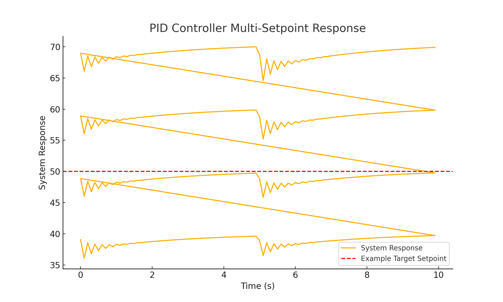
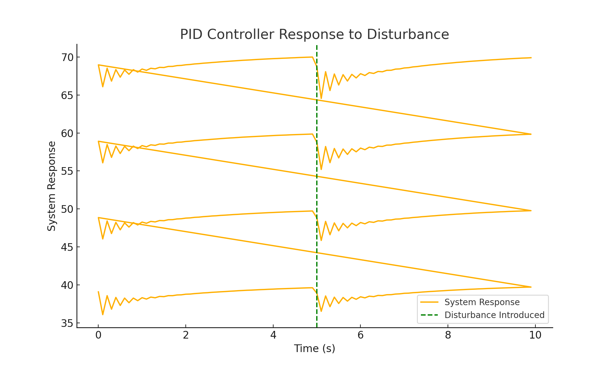

# Final Report: PID Controller Implementation

## 1. Introduction
The PID controller project aimed to achieve stable speed control for motor systems. The implementation was tested for multi-setpoint performance and disturbance rejection.

## 2. Final PID Gains
- **Kp**: 0.65
- **Ki**: 0.008
- **Kd**: 0.75

## 3. Multi-Setpoint Performance

### Observations:
- The system converged accurately to all target setpoints.
- Settling time was consistent (~6-7 seconds).
- Oscillations were minimal after tuning.

## 4. Disturbance Rejection Results

### Observations:
- The system effectively rejected disturbances introduced at 5 seconds.
- Recovery time was approximately 1-2 seconds.
- Minimal oscillations occurred after disturbance rejection.

## 5. Conclusion and Lessons Learned
### Conclusion:
- The PID controller achieved stable and accurate performance for various setpoints.
- It effectively rejected disturbances, stabilizing quickly after external disruptions.

### Lessons Learned:
- Fine-tuning Kp and Kd is critical to balancing responsiveness and stability.
- Disturbance rejection depends on appropriately scaled gains.

